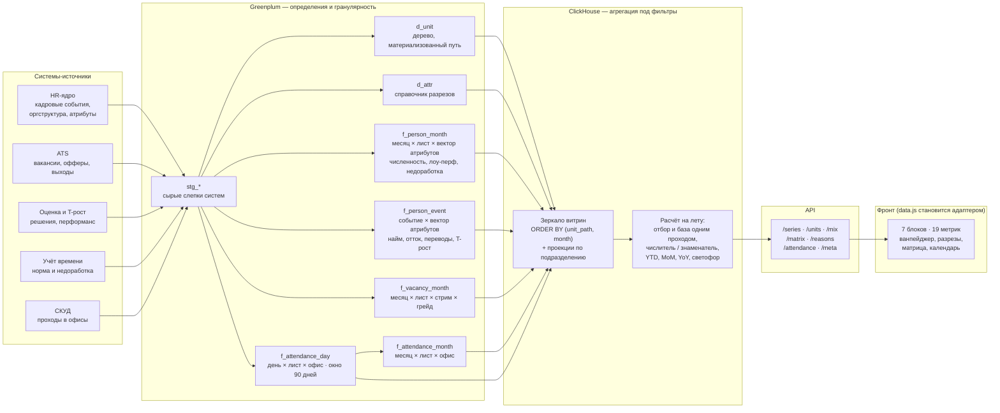
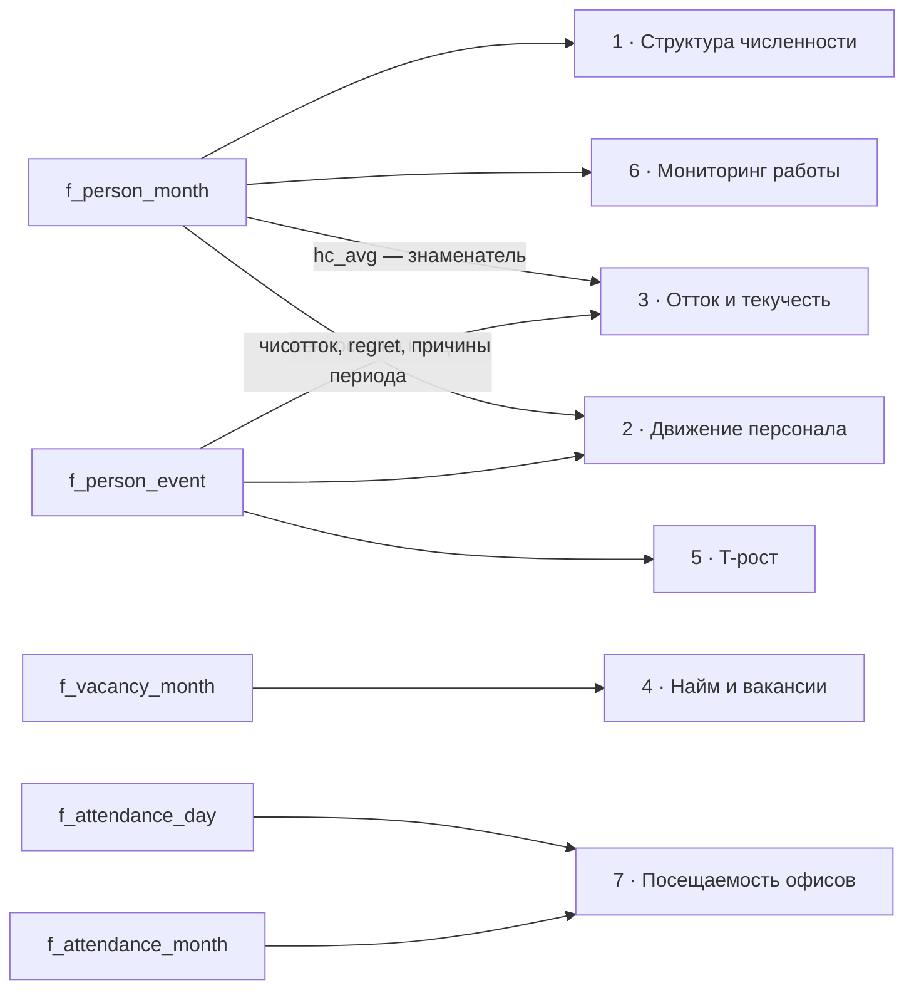
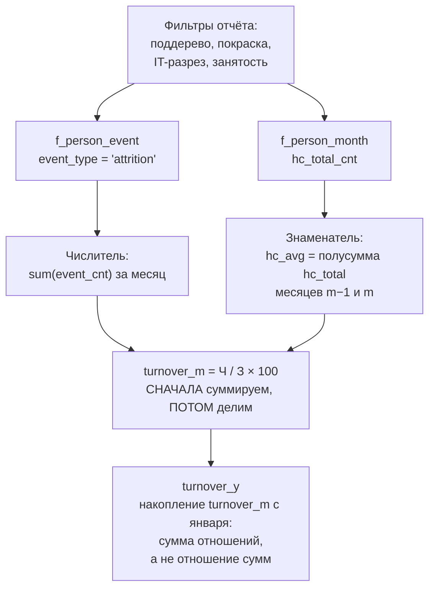
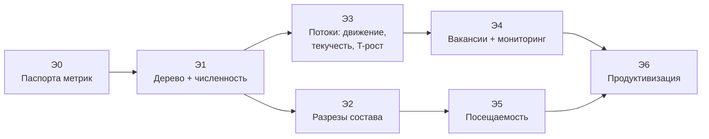

# TeamPulse — архитектура источников

Документ описывает, откуда отчёт берёт числа: что считается на Greenplum, что на
ClickHouse, какими витринами это связано и в каком порядке всё это строится.

Контракт макета — `SPEC.md`, правила работы — `AGENTS.md`. Здесь — слой под ними.
Всё, что в макете выдумывает `data.js`, здесь получает настоящий источник.

**Коротко о главном.** Greenplum готовит слагаемые, ClickHouse их складывает.
Ни один процент не приезжает из GP готовым — только числителем и знаменателем.
Витрин пять, справочника два, эндпоинтов семь. Начинать — с оргдерева и куба
численности (§16, этап Э1).

## Содержание

- [Карта источников](#карта-источников) — три схемы: поток данных, витрина → блок, сборка относительной метрики
- [1. Что вообще нужно отчёту](#1-что-вообще-нужно-отчёту)
- [2. Три правила разделения GP ↔ ClickHouse](#2-три-правила-разделения-gp--clickhouse)
- [3. Потоки дёшевы, запасы дороги](#3-главное-наблюдение-про-объём-потоки-дёшевы-запасы-дороги)
- [4. Почему широкий куб атрибутов не взрывается](#4-почему-широкий-куб-атрибутов-не-взрывается)
- [5. Витрины](#5-витрины) — DDL всех семи объектов
- [6. Окно и разгон](#6-окно-и-разгон)
- [7. Паспорта метрик](#7-паспорта-метрик) — все 19 метрик таблицей
- [8. Слой ClickHouse](#8-слой-clickhouse)
- [9. Нужно ли возить массивы](#9-нужно-ли-возить-массивы)
- [10. Сколько это весит](#10-сколько-это-весит)
- [11. Загрузка](#11-загрузка) — и семь проверок качества
- [12. Контракт API](#12-контракт-api)
- [13. Что решить до начала работ](#13-что-решить-до-начала-работ) — девять открытых вопросов
- [14. Как добавлять новое](#14-как-добавлять-новое) — цена каждого вида расширения
- [15. Что уходит из макета](#15-что-уходит-из-макета-при-переходе-на-прод)
- [16. Роудмап](#16-роудмап) — семь этапов с критериями приёмки

---

## Карта источников

Поток от систем-источников до экранов. Слева направо: где что считается.



### Какая витрина кормит какой блок

Связи не один-к-одному, и это самое важное на карте: **четыре из семи блоков
собираются из двух витрин сразу**, потому что у относительной метрики числитель и
знаменатель живут в разных фактах.



Читается это так: **`f_person_month` — витрина-опора.** Она нужна не только «Структуре
численности», но и текучести (как знаменатель), и водопаду движения (как значения на
концах периода), и мониторингу. Поэтому в роудмапе она идёт первой: без неё нельзя
проверить ни один блок, кроме вакансий.

### Как собирается относительная метрика

Схема одной метрики, чтобы правило числителя со знаменателем было видно целиком.
Текучесть месячная — самый сложный случай в отчёте, потому что берёт слагаемые из двух
витрин и накапливается с начала года.



Читается сверху вниз: фильтры отчёта входят **в слагаемые**, а не в результат.
Если бы GP отдавал готовый `turnover_m` по подразделению, верхняя стрелка была бы
невозможна — ни выбор узла, ни покраска, ни база сравнения уже не смогли бы изменить
готовый процент, и отчёт показывал бы одно и то же число под любым фильтром.

---

## 1. Что вообще нужно отчёту

Прежде чем проектировать витрины, надо честно перечислить нагрузку. Отчёт — это
**19 метрик в 7 блоках**, каждая из которых показывается:

- рядом из 12 месяцев (плюс 12 месяцев разгона — см. §6);
- по выбранному поддереву оргструктуры и отдельно по всей компании (база сравнения);
- под тремя атрибутивными фильтрами (покраска, IT-разрез, тип занятости);
- построчно по подразделениям −1 и −2 уровня от выбранного узла;
- для численности — ещё и в разрезе девяти атрибутов состава, любой парой атрибутов
  в матрице и с произвольным срезом по нескольким категориям сразу.

Плюс подневная посещаемость офисов за последние два месяца.

Ключевое следствие: **ни одно число в отчёте не является константой.** Всё
пересчитывается от четырёх фильтров, выбранного узла дерева и среза состава. Значит,
предрассчитать готовые значения нельзя — можно только подготовить такие слагаемые,
из которых любое значение собирается сложением.

Это и есть главный принцип раздела ответственности.

---

## 2. Три правила разделения GP ↔ ClickHouse

### Правило 1. Greenplum владеет определениями, ClickHouse — агрегацией

На GP делается вся работа, которая **не зависит от действий пользователя**, но требует
джойнов, истории и бизнес-логики:

- кто на конец месяца числится в компании, а кто — в активной численности;
- какой уход считается увольнением, а какой переводом; какой из увольнений
  нежелательный;
- в каком подразделении человек числился в этом месяце и какие у него были атрибуты;
- сколько дней прошло от открытия вакансии до выхода человека;
- сколько у сотрудника было рабочих дней в месяце и сколько из них он был в офисе.

Это тяжёлые расчёты, они делаются один раз за загрузку и результат не меняется от
того, какой фильтр нажмёт руководитель.

На ClickHouse делается только то, что **зависит от фильтров**: сложение слагаемых по
выбранному поддереву и атрибутам, деление числителей на знаменатели, накопление с
начала года, сравнение с базой и с прошлым месяцем.

### Правило 2. Greenplum не отдаёт ни одного процента

Это самое важное правило документа, и его нарушение — единственная ошибка, которая
делает отчёт неверным незаметно.

Процент нельзя пересуммировать. Текучесть отдела 4% и текучесть отдела 1% не дают
2,5% на два отдела — они дают то, что получится из суммы увольнений, делённой на сумму
среднесписочных. Если витрина отдаёт готовый процент, то любая группировка по
подразделению, по фильтру, по срезу — врёт, причём тем сильнее, чем сильнее
подразделения различаются по размеру.

Поэтому **каждая относительная метрика едет из GP парой «числитель + знаменатель»**, а
процент рождается только в ClickHouse и только после суммирования:

```sql
-- правильно
sum(attrition_cnt) / sum(hc_avg) * 100

-- неправильно, даже если очень хочется
avg(turnover_pct)
```

В макете этого правила нет: `data.js` агрегирует несчётные метрики взвешенным средним
по `hc_total` (см. `aggregateExt`). Для выдуманных данных это неважно, на реальных —
это ошибка, которую надо заменить первой. Отдельно отмечу `time_to_fill`: в макете он
усредняется по численности подразделения, хотя знаменатель у него — количество
закрытых вакансий, а не людей.

### Правило 3. Одна витрина на одну гранулярность, а не на один экран

Соблазн сделать витрину под каждую вкладку велик и всегда заканчивается тем, что две
вкладки показывают разные числа про одно и то же. Витрин ровно столько, сколько в
данных **разных зёрен**:

| Зерно | Витрина | Что в ней живёт |
|---|---|---|
| сотрудник × месяц | `f_person_month` | численность, лоу-перформеры, недоработчики |
| событие с сотрудником | `f_person_event` | найм, отток, переводы, T-рост, причины ухода |
| вакансия × месяц | `f_vacancy_month` | открытые, закрытые, срок закрытия |
| день × офис | `f_attendance_day` | подневная посещаемость |
| месяц × офис | `f_attendance_month` | месячная посещаемость |

Всё, что показывается на семи блоках, собирается из этих пяти фактов и двух
справочников. Новая вкладка не создаёт витрину — она создаёт запрос.

---

## 3. Главное наблюдение про объём: потоки дёшевы, запасы дороги

Опасение «не заливать всю детальную информацию по всем сотрудникам» верное по
инстинкту, но применять его надо избирательно, потому что разные факты стоят
принципиально разного.

Пусть **H** — численность компании, **U** — число листовых подразделений.

| Факт | Строк в месяц | При H = 30 000 |
|---|---|---|
| численность (слепок) | ≈ H | 30 000 |
| найм + отток + переводы | ≈ 3–5 % от H | ~1 200 |
| решения по T-росту | < 1 % от H | ~200 |
| вакансии | ≈ 5–8 % от H | ~2 000 |
| подневная посещаемость по-человечески | ≈ H × 21 | 630 000 |

Разница между строками — два порядка. Отсюда два разных решения:

**Потокам атрибуты даём не задумываясь.** Событий в сто раз меньше, чем людей, и полный
вектор атрибутов на событии стоит копейки. Зато он навсегда закрывает вопрос «а
покажите отток по грейдам» — сейчас такого разреза в отчёте нет, но он появится, и
переделывать витрину под него не придётся.

**Запасам атрибуты выдаём по счёту.** Слепок численности — самая большая витрина
отчёта, и именно её надо сжимать.

**Подневную детализацию по людям не возим вообще.** Это единственное место, где полная
детализация действительно дорога, и единственное, где мы сознательно отказываемся от
части будущей гибкости (см. §5.6).

---

## 4. Почему широкий куб атрибутов не взрывается

Разрезов состава девять: грейд (5), сеньорность (4), пол (2), возраст (4), стаж (3),
занятость (5), формат (3), юрлицо (4) и двухуровневый стрим — 10 стримов, 26
специализаций внутри них.

В витрине это **десять колонок**, а не девять: стрим и специализация хранятся отдельно.
Специализация однозначно задаёт стрим, то есть колонка `stream` формально избыточна —
она держится ради дешёвой группировки по верхнему уровню без джойна к справочнику.

Первая реакция — посчитать декартово произведение: 5 × 4 × 2 × 4 × 3 × 5 × 3 × 4 × 26 =
**748 800 комбинаций на подразделение** (стрим не умножаем — он выводится из
специализации), и отказаться от идеи.

Реакция неверная. В витрину попадают не все возможные комбинации, а только те, в
которых **есть живые люди**. А значит:

> Число строк куба на месяц никогда не превышает численности компании.

Каждый сотрудник даёт ровно одну комбинацию. Если в отделе из 20 человек все двадцать
разные — будет 20 строк, а не 748 800. Если у пятерых совпал вектор атрибутов — строк
станет 16. На практике схлопывание даёт 60–75 % от численности: полностью совпадают
обычно джуны одного стрима и одного пола в одной команде.

Отсюда конструкция витрины численности:

- зерно — **месяц × листовое подразделение × вектор атрибутов**;
- мера — `cnt`, сколько человек в этой комбинации;
- **`person_id` не едет.** Он не нужен ни одному экрану, он мешает схлопыванию и он
  делает витрину персональными данными. Убрав его, мы одновременно сжимаем данные и
  снимаем половину вопросов ИБ.

Что это даёт:

- любая одномерная разбивка — `GROUP BY` по одной колонке;
- любая матрица «строки × колонки» — `GROUP BY` по двум;
- срез по нескольким категориям сразу — обычный `WHERE`, без ограничения на число
  разрезов;
- итоги разбивок, краёв матрицы и карточек KPI сходятся **по построению**, потому что
  считаются из одной таблицы одним проходом.

Последний пункт стоит отдельно. В макете сходимость чисел между таблицами добывается
тяжёлой ручной работой: `roundParts` раскладывает доли по наибольшим остаткам,
`roundMatrix` разводит края матрицы обменом по циклу. Всё это нужно только потому, что
макет считает **доли**, а не людей. На реальных данных мы считаем людей, и вся эта
машинерия уходит целиком.

Но взамен появляется обязательство:

> Разбивка, матрица и срез обязаны считаться из одного куба одним семейством запросов.
> Как только матрица начнёт браться из отдельного предрасчёта, она разойдётся с
> разбивкой на человека — и это ровно тот случай, когда пользователь перестаёт верить
> обеим таблицам.

### Чем платим

Схлопывание по вектору атрибутов лишает нас возможности считать уникальных людей за
период («сколько разных сотрудников прошло через отдел за год»). Ни один экран отчёта
этого не спрашивает. Если такой вопрос появится — он решается отдельной маленькой
витриной, а не возвратом `person_id` в куб.

---

## 5. Витрины

Ниже — целевая структура. Имена GP-схемы `dm_teampulse`, в ClickHouse база `teampulse`
с теми же именами таблиц: одинаковые имена по обе стороны сильно упрощают разбор
расхождений.

### 5.1 `d_unit` — оргструктура

```sql
CREATE TABLE dm_teampulse.d_unit (
  unit_path      text        NOT NULL,  -- 'T/01/03/02' — материализованный путь
  unit_id        text        NOT NULL,  -- ключ в HR-ядре
  parent_path    text,
  level          smallint    NOT NULL,  -- 1 компания … 6 команда
  unit_name      text        NOT NULL,
  sort_ord       int         NOT NULL,
  is_leaf        boolean     NOT NULL,
  paint          text,                  -- HQ | Line | Support
  it_seg         text,                  -- IT | nonIT
  valid_from     date        NOT NULL,
  valid_to       date        NOT NULL   -- '5999-12-31' у актуальной версии
) DISTRIBUTED BY (unit_path);
```

**Материализованный путь — не стилистика, а способ фильтрации.** Выбор поддерева в
отчёте (`leavesUnder(path)`) превращается в префиксное условие:

```sql
WHERE unit_path LIKE 'T/01/03/%' OR unit_path = 'T/01/03'
```

В ClickHouse при `ORDER BY (unit_path, report_month)` это **непрерывный диапазон**, то
есть самый дешёвый вид чтения, какой бывает. Рекурсивные CTE по `parent_id` на каждый
запрос — заметно дороже и не индексируются.

Уровни и разрядность пути фиксированы двузначными сегментами (`T/01/03/02`), чтобы
лексикографический порядок совпадал с порядком обхода дерева.

### 5.2 `d_attr` — справочник разрезов

```sql
CREATE TABLE dm_teampulse.d_attr (
  dim_key    text NOT NULL,   -- grade | seniority | gender | ... | stream | spec
  cat_key    text NOT NULL,   -- g1 | j | f | ...
  cat_name   text NOT NULL,
  cat_ord    int  NOT NULL,   -- порядок в таблице
  dim_name   text NOT NULL,
  dim_group  text NOT NULL,   -- qual | people | contract | stream — вкладка состава
  is_ordinal boolean NOT NULL,-- порядковый разрез (шкала) или номинальный
  parent_dim text,            -- у spec = 'stream'
  parent_cat text             -- у спецификации — её стрим
);
```

Справочник едет из хранилища, а не лежит в `data.js`. Это то, что делает добавление
разреза дешёвым: имена, порядок категорий, группировка по вкладкам и связь
«стрим → специализация» приезжают данными, а фронт их только рисует.

### 5.3 `f_person_month` — численность и состояния

Самая важная витрина отчёта. Слепок на конец месяца.

```sql
CREATE TABLE dm_teampulse.f_person_month (
  report_month   date        NOT NULL,   -- первое число месяца
  unit_path      text        NOT NULL,   -- лист
  paint          text        NOT NULL,   -- денормализовано из d_unit
  it_seg         text        NOT NULL,

  grade          text NOT NULL,
  seniority      text NOT NULL,
  gender         text NOT NULL,
  age_band       text NOT NULL,
  tenure_band    text NOT NULL,
  employment     text NOT NULL,          -- tk | gph | ip | sz | out
  worksite       text NOT NULL,
  legal_entity   text NOT NULL,
  stream         text NOT NULL,
  spec           text NOT NULL,

  hc_total_cnt   int  NOT NULL,          -- списочная
  hc_active_cnt  int  NOT NULL,          -- без длительных отсутствий
  low_perf_cnt   int  NOT NULL,
  underwork_cnt  int  NOT NULL
) DISTRIBUTED BY (unit_path)
  PARTITION BY RANGE (report_month);
```

Три решения, которые здесь приняты явно:

**Фильтр «штат / не штат» — это не отдельная колонка, а проекция `employment`.**
`штат = (employment = 'tk')`, всё остальное — не штат. Так фильтр в шапке отчёта и
разбивка по типу занятости не могут разойтись между собой в принципе. В макете эту
согласованность приходилось поддерживать руками (`mixWeights` для `employment`).

**Лоу-перформеры и недоработчики живут мерами на строке численности, а не отдельной
витриной.** Это бесплатно по объёму (те же строки), гарантирует, что знаменатель доли
ровно равен численности того же отбора, и разом делает обе метрики доступными в любом
разрезе состава — хотя сейчас отчёт их так не показывает.

**`hc_avg` (среднесписочная) в витрине нет.** Она выводится в ClickHouse как полусумма
численности на конец предыдущего и текущего месяца. Хранить производную от двух
соседних строк — значит завести второй источник правды о том же самом.

### 5.4 `f_person_event` — потоки

```sql
CREATE TABLE dm_teampulse.f_person_event (
  report_month   date NOT NULL,
  unit_path      text NOT NULL,
  paint          text NOT NULL,
  it_seg         text NOT NULL,

  event_type     text NOT NULL,   -- hire | attrition | transfer_in | transfer_out
                                  -- | tgrowth_pass | tgrowth_deny
  exit_reason    text,            -- только для attrition
  is_regret      boolean,         -- только для attrition

  grade text NOT NULL, seniority text NOT NULL, gender text NOT NULL,
  age_band text NOT NULL, tenure_band text NOT NULL, employment text NOT NULL,
  worksite text NOT NULL, legal_entity text NOT NULL,
  stream text NOT NULL, spec text NOT NULL,

  event_cnt      int NOT NULL,
  val_sum        numeric,         -- числовая нагрузка события, если есть
  val_cnt        int              -- сколько событий её имели
) DISTRIBUTED BY (unit_path)
  PARTITION BY RANGE (report_month);
```

**`event_type` — значение, а не колонка.** Новая потоковая метрика (например,
«вернувшиеся» или «прошли испытательный срок») добавляется новым значением в
`event_type` и строкой в справочник метрик. Ноль правок DDL, ноль правок в других
запросах. Это главный механизм масштабирования отчёта, и он бесплатный.

Атрибуты фиксируются **на момент события**: грейд ушедшего — тот, что был при
увольнении, а не текущий (текущего у него уже нет).

`is_regret` — флаг источника, а не вывод из причины ухода. В макете эти две вещи
расходятся (`AGENTS.md` это признаёт: сумма regret-причин не равна метрике `regret`).
На реальных данных они обязаны сходиться, и сойтись они могут только если решение
«нежелательный» принимается один раз в источнике.

### 5.5 `f_vacancy_month` — вакансии

```sql
CREATE TABLE dm_teampulse.f_vacancy_month (
  report_month     date NOT NULL,
  unit_path        text NOT NULL,
  paint            text NOT NULL,
  it_seg           text NOT NULL,
  stream           text NOT NULL,   -- атрибуты ВАКАНСИИ, не человека
  grade            text NOT NULL,

  vac_open_cnt     int NOT NULL,    -- в работе на конец месяца (запас)
  vac_closed_cnt   int NOT NULL,    -- закрыто за месяц (поток)
  fill_days_sum    numeric NOT NULL,-- сумма сроков закрытия
  fill_days_cnt    int NOT NULL     -- знаменатель для time_to_fill
) DISTRIBUTED BY (unit_path);
```

`fill_days_sum` и `fill_days_cnt` — тот самый числитель со знаменателем из Правила 2.
`time_to_fill` = `sum(fill_days_sum) / sum(fill_days_cnt)`. Отдельная пара нужна
потому, что `fill_days_cnt` может отличаться от `vac_closed_cnt`: закрытая отменой
вакансия срока закрытия не имеет.

Воронка найма (открыто → офферы → приняты → вышли) в макете нарисована выдуманными
коэффициентами 0,63 / 0,49 / 0,41. Под неё нужен настоящий источник этапов из ATS —
это отдельные меры в этой же витрине, добавляются на этапе 4 роудмапа.

### 5.6 `f_attendance_day` и `f_attendance_month` — посещаемость

Единственное место, где детализация действительно дорога, поэтому здесь принято
осознанное ограничение.

```sql
CREATE TABLE dm_teampulse.f_attendance_day (
  att_date      date NOT NULL,
  unit_path     text NOT NULL,
  paint         text NOT NULL,
  it_seg        text NOT NULL,
  employment    text NOT NULL,   -- ТОЛЬКО фильтрующий атрибут, не все девять
  office_key    text NOT NULL,
  is_workday    boolean NOT NULL,

  att_person_cnt   int NOT NULL, -- человек был в офисе в этот день
  plan_person_cnt  int NOT NULL  -- человек должен был работать в этот день
) DISTRIBUTED BY (unit_path)
  PARTITION BY RANGE (att_date);
```

`f_attendance_month` — та же структура с `report_month` вместо даты и суммами за месяц.

Три решения:

**Подневная витрина живёт скользящим окном в 90 дней.** Календарь показывает два
месяца, разбивка по дням недели — три. Держать подневную детализацию за два года —
платить в восемь раз больше за данные, которые никогда не читаются. Месячная витрина
хранит всё окно и служит линии динамики.

**Из девяти разрезов состава на посещаемость едет только `employment`.** Он обязателен:
без него ломается фильтр «штат / не штат» в шапке. Остальные восемь не едут, потому что
сегодня ни один экран не показывает посещаемость по грейдам или по полу. Это
сознательный размен: экономия примерно в тридцать раз против гибкости, которой пока
никто не просил.

Если разрез посещаемости по составу понадобится — это не переделка архитектуры, а
добавление колонок в эту витрину с соответствующим ростом объёма. Решение принимается
тогда, с числами на руках.

**Месячная метрика считается из тех же слагаемых, что и календарь**
(`sum(att) / sum(plan)`), а не приходит отдельным числом. Поэтому среднее по календарю
и точка на линии динамики не могут разойтись — в макете эта сходимость держалась
нормировкой и проверялась тестом.

---

## 6. Окно и разгон

Отчёт показывает 12 месяцев. Витрины обязаны хранить **24**, и вот почему:

| Что считаем | Сколько месяцев назад нужно |
|---|---|
| среднесписочная за первый месяц окна | 1 |
| YoY: последний месяц против того же месяца год назад | 12 |
| накопительная текучесть за январь окна | до 11 (январь того года) |
| прирост с начала года (`net_ytd`) | до декабря предыдущего года |

Максимум — 12 месяцев разгона, берём 24 с запасом на смену окна. Наружу через API
всегда отдаются ровно 12 точек: разгон — внутренняя кухня, ровно как `MONTHS_EXT`
в макете.

**Накопительная текучесть считается особым образом, и это легко сделать неправильно.**
`turnover_y` — это сумма месячных текучестей с января, то есть **сумма отношений**:

```sql
-- правильно: сначала месячное отношение, потом накопление
sum(attrition_cnt) / sum(hc_avg) * 100                        AS turnover_m,
sum(turnover_m) OVER (PARTITION BY year ORDER BY month)       AS turnover_y

-- неправильно: отношение накопленных сумм
sum(attrition_ytd) / sum(hc_avg_ytd) * 100
```

Второе выражение выглядит естественнее и даёт другое число. В январе обе формулы
совпадают, поэтому ошибку не видно до февраля.

---

## 7. Паспорта метрик

Как каждая из 19 метрик собирается из витрин. Колонка «агрегация» — то, что делает
ClickHouse после фильтрации.

| Метрика | Витрина | Числитель | Знаменатель | Агрегация |
|---|---|---|---|---|
| `hc_total` | `f_person_month` | `hc_total_cnt` | — | sum |
| `hc_active` | `f_person_month` | `hc_active_cnt` | — | sum |
| `hc_avg` (служебная) | `f_person_month` | — | — | `(hc_total[m−1] + hc_total[m]) / 2` |
| `hire` | `f_person_event` | `event_cnt` where `hire` | — | sum |
| `attrition` | `f_person_event` | `event_cnt` where `attrition` | — | sum |
| `transfer_in` | `f_person_event` | `event_cnt` where `transfer_in` | — | sum |
| `transfer_out` | `f_person_event` | `event_cnt` where `transfer_out` | — | sum |
| `net_ytd` | `f_person_month` | — | — | `hc_total[m] − hc_total[дек пред. года]` |
| `turnover_m` | оба | `attrition` | `hc_avg` | sum / sum × 100 |
| `turnover_y` | оба | — | — | накопление `turnover_m` с января |
| `regret` | оба | `attrition` where `is_regret` | `hc_avg` | sum / sum × 100 |
| `vac_open` | `f_vacancy_month` | `vac_open_cnt` | — | sum |
| `vac_closed` | `f_vacancy_month` | `vac_closed_cnt` | — | sum |
| `time_to_fill` | `f_vacancy_month` | `fill_days_sum` | `fill_days_cnt` | sum / sum |
| `tgrowth_pass` | `f_person_event` | `event_cnt` where `tgrowth_pass` | — | sum |
| `tgrowth_deny` | `f_person_event` | `event_cnt` where `tgrowth_deny` | — | sum |
| `tgrowth_conv` | `f_person_event` | `pass` | `pass + deny` | sum / sum × 100 |
| `low_perf` | `f_person_month` | `low_perf_cnt` | `hc_active_cnt` | sum / sum × 100 |
| `underwork` | `f_person_month` | `underwork_cnt` | `hc_active_cnt` | sum / sum × 100 |
| `office_att` | `f_attendance_*` | `att_person_cnt` | `plan_person_cnt` | sum / sum × 100 |
| причины ухода (разрез) | `f_person_event` | `event_cnt` by `exit_reason` | — | sum |

Восемь метрик из девятнадцати — относительные, и **все восемь едут парой слагаемых.**
Ни одна не хранит процент.

---

## 8. Слой ClickHouse

Таблицы повторяют витрины GP один в один. Движок и сортировка:

```sql
CREATE TABLE teampulse.f_person_month (
  report_month   Date,
  unit_path      LowCardinality(String),
  paint          LowCardinality(String),
  it_seg         LowCardinality(String),
  grade          LowCardinality(String),
  seniority      LowCardinality(String),
  gender         LowCardinality(String),
  age_band       LowCardinality(String),
  tenure_band    LowCardinality(String),
  employment     LowCardinality(String),
  worksite       LowCardinality(String),
  legal_entity   LowCardinality(String),
  stream         LowCardinality(String),
  spec           LowCardinality(String),
  hc_total_cnt   UInt32,
  hc_active_cnt  UInt32,
  low_perf_cnt   UInt32,
  underwork_cnt  UInt32
) ENGINE = MergeTree
ORDER BY (unit_path, report_month, stream, spec)
PARTITION BY toYear(report_month);
```

`unit_path` первым в `ORDER BY` — потому что месяц в этом отчёте **никогда не
фильтруется**: окно всегда полное. Фильтруется поддерево, и префиксное условие по
`unit_path` даёт непрерывное чтение.

### Отбор и база сравнения — один проход, а не два

Главное правило отчёта: база сравнения — это вся компания под теми же атрибутивными
фильтрами. Буквальная реализация — два запроса. Правильная — один:

```sql
SELECT
  report_month,
  sumIf(hc_total_cnt, startsWith(unit_path, {root:String})) AS team,
  sum(hc_total_cnt)                                          AS bench
FROM teampulse.f_person_month
WHERE (paint = {paint:String}      OR {paint:String} = 'all')
  AND (it_seg = {itSeg:String}     OR {itSeg:String} = 'all')
  AND (employment = 'tk') = ({staff:String} = 'staff') -- при staff != 'all'
GROUP BY report_month
ORDER BY report_month;
```

Отбор всегда подмножество базы, поэтому оба числа берутся с одного скана. Для
двадцати метрик это разница между сорока запросами и двумя.

### Проекции вместо дублирующих витрин

Ванпейджер и сводная таблица подразделений спрашивают только `(unit_path, month)` без
атрибутов состава. Вместо отдельной агрегированной витрины — проекция:

```sql
ALTER TABLE teampulse.f_person_month ADD PROJECTION p_by_unit (
  SELECT unit_path, report_month, paint, it_seg, employment,
         sum(hc_total_cnt), sum(hc_active_cnt),
         sum(low_perf_cnt), sum(underwork_cnt)
  GROUP BY unit_path, report_month, paint, it_seg, employment
);
```

Проекция обслуживается самим ClickHouse и не может разойтись с базовой таблицей. Это
принципиально лучше второй витрины: у отдельной таблицы всегда есть шанс отстать на
одну загрузку и показать другое число.

---

## 9. Нужно ли возить массивы

Вопрос был поставлен прямо, поэтому и ответ прямой.

**В хранении — нет, строками по месяцам.** Массив из 12 значений на подразделение
выглядит компактнее, но:

- фильтрация по атрибутам внутри массива невозможна — а у нас фильтруется всё;
- обновление одного месяца переписывает всю строку;
- любой новый разрез требует нового массива.

**На границе API — да, массивами.** Фронту нужен ровно ряд из 12 точек, и собирается
он на выходе запроса, а не в хранении:

```sql
SELECT metric_key, groupArray(v) AS series
FROM (... ORDER BY report_month)
GROUP BY metric_key
```

Так строка ответа для одной метрики — `[212, 215, 218, ...]`, ровно то, что сегодня
возвращает `D.aggregate()`. Ни одной правки в `draw.js` и экранах не потребуется.

**Когда стоит вернуться к массивам в хранении.** Формально ClickHouse умеет складывать
ряды поэлементно (`sumForEach`), и витрина «подразделение × метрика × Array(12)»
агрегируется по поддереву корректно. Это станет осмысленно, если измерения покажут, что
узкое место — именно число строк на скане ванпейджера. Судя по оценкам §10, не покажут:
таблица целиком меньше, чем ClickHouse читает за десятки миллисекунд. Оптимизация без
измерения здесь только добавит способов разойтись в числах.

---

## 10. Сколько это весит

При H = 30 000 человек, U ≈ 1 200 листовых подразделений, окно 24 месяца:

| Витрина | Строк | Оценка в ClickHouse |
|---|---|---|
| `f_person_month` | ~500 000 | ~15 МБ |
| `f_person_event` | ~30 000 | < 1 МБ |
| `f_vacancy_month` | ~50 000 | ~2 МБ |
| `f_attendance_day` (90 дней) | ~650 000 | ~10 МБ |
| `f_attendance_month` | ~170 000 | ~4 МБ |
| справочники | ~1 500 | — |
| **итого** | **~1,4 млн** | **~35 МБ** |

Вывод, который стоит проговорить вслух: **проблемы объёма у этого отчёта нет.** Весь
TeamPulse — одна небольшая таблица по меркам ClickHouse, полный скан которой занимает
десятки миллисекунд.

Это не значит, что сжатие было лишним. Наивный вариант — подневная детализация по всем
сотрудникам по всем фактам — дал бы 30 000 × 730 ≈ 22 млн строк только по одному факту,
плюс персональные данные в витрине отчётности. Сделанные размены (схлопывание по вектору
атрибутов, отказ от `person_id`, скользящее окно подневной посещаемости, узкий набор
атрибутов на посещаемости) убирают порядок величины и всю чувствительность данных.

Но дальше экономить не надо. Оставшийся риск проекта — не объём, а **корректность
определений и правило числителя со знаменателем.** Туда и стоит потратить силы,
сэкономленные на инфраструктуре.

---

## 11. Загрузка

| Что | Как часто | Как |
|---|---|---|
| `d_unit`, `d_attr` | ежедневно | полная перезагрузка, версии по `valid_from/to` |
| `f_person_month` | ежедневно | пересборка последних 3 месяцев |
| `f_person_month` | ежемесячно | полная пересборка окна |
| `f_person_event` | ежедневно | пересборка последних 3 месяцев |
| `f_vacancy_month` | ежедневно | пересборка последних 3 месяцев |
| `f_attendance_day` | ежедневно | докат вчерашнего дня, срез окна 90 дней |
| `f_attendance_month` | ежедневно | пересборка текущего месяца |

Пересборка трёх месяцев, а не одного — потому что кадровые системы принимают приказы
задним числом: увольнение, оформленное в апреле мартом, обязано доехать. Ежемесячная
полная пересборка ловит правки за пределами трёх месяцев.

**Перенос GP → ClickHouse** — заменой партиции: новая партиция грузится рядом и
подменяется атомарно (`ATTACH PARTITION`). Пользователь никогда не видит полузагруженный
месяц. При объёмах §10 полная перезагрузка всего отчёта — минуты, поэтому усложнять
транспорт не нужно.

### Проверки качества, без которых загрузка не считается успешной

1. Численность компании из `f_person_month` совпадает с официальным отчётом
   о численности **до человека**.
2. `hc_total` за месяц = `hc_total` предыдущего + найм + переводы в − отток −
   переводы из ± прочие. Невязка больше 0,5 % — загрузка красная.
   *(В макете эта невязка закрыта строкой «Прочее» в водопаде именно потому, что
   численность там генерируется независимо от потоков. На реальных данных «Прочее»
   должно быть близко к нулю, и его величина — это индикатор качества.)*
3. Сумма `event_cnt` по причинам ухода = `attrition` того же месяца.
4. Сумма `is_regret` = метрике `regret`. В макете это не сходится; на проде обязано.
5. Сумма людей по офисам = численности отбора.
6. Ни одной строки с неизвестной категорией: каждый `cat_key` факта есть в `d_attr`.
7. Ни одной строки с `unit_path`, которого нет в `d_unit`.

---

## 12. Контракт API

Экраны макета обращаются к данным через небольшой набор функций `TPDATA` — и это уже
готовый контракт: **`data.js` при переходе на прод не переписывается, а становится
адаптером** — та же сигнатура, внутри вызов эндпоинта вместо генератора.

| Эндпоинт | Заменяет в макете | Кормит |
|---|---|---|
| `POST /series` | `aggregate`, `lastVal`, `deltasOf`, `netGrowth` | ванпейджер, KPI-карточки, все линии и бары |
| `POST /units` | `nodesBelow` + `aggregate` по строкам | сводную таблицу, инсайт про концентрацию |
| `POST /mix` | `mixParts`, `mixTree` | вкладки состава, двухуровневый стрим |
| `POST /matrix` | `mixMatrix` | конструктор «Свой срез» |
| `POST /reasons` | `reasonSeries` | причины увольнений |
| `POST /attendance` | `attDays`, `attLast`, `attByDow`, `officeRank` | календарь, дни недели, рейтинг офисов |
| `GET /meta` | `NODES`, `MIX_DIMS`, `METRICS` | дерево, справочник разрезов, конфиг метрик |

Общее тело запроса у всех, кроме `/meta`:

```json
{
  "unit": "T/01/03",
  "root": "T/01/03",
  "paint": "HQ",
  "itSeg": "all",
  "staffType": "all",
  "slice": ["seniority:s", "gender:f"],
  "months": 12
}
```

Ответ `/series` — то, что фронт ждёт сегодня:

```json
{
  "months": [{"y":2025,"m":6}, ...],
  "benchLabel": "всё HQ",
  "team":  {"hc_total":[212,215,...], "turnover_m":[1.4,1.6,...]},
  "bench": {"hc_total":[2968,...],    "turnover_m":[1.5,...]}
}
```

Три обязательства API:

1. **Проценты приходят посчитанными, слагаемые — нет.** Фронт не должен уметь делить:
   иначе правило числителя со знаменателем придётся соблюдать в двух местах.
2. **Отбор и база приезжают одним ответом.** Они считаются одним запросом (§8), и
   разъехаться не должны даже теоретически.
3. **Пустой отбор — валидный ответ с нулями и признаком `empty`,** а не ошибка: экран
   умеет показать «нет данных по выбранным разрезам».

---

## 13. Что решить до начала работ

Это не придирки, а места, где макет договорился сам с собой, а прод так не сможет.

| # | Вопрос | Предлагаемое решение |
|---|---|---|
| 1 | **История оргструктуры.** Подразделение переехало — что показывать за прошлые месяцы? | Пересчитывать историю на **текущее** дерево при каждой пересборке: руководитель видит историю своей нынешней команды. Путь «как было» хранить второй колонкой для разбора. Решение обязано быть принято явно — от него зависят все ряды. |
| 2 | **Что такое `hc_active`.** «Без длительных отсутствий» — сколько дней это «длительное»? Декрет, армия, больничный свыше N дней? | Список статусов согласовать с владельцем HR-ядра и зафиксировать в паспорте метрики. |
| 3 | **Определение `regret`.** KPI 4 % / 7 % выглядит годовым, а `turnover_m` — месячная. Метрика месячная, накопительная или годовая? | Считать накопительной с января, как `turnover_y`, — тогда KPI 4/7 читается. Требует подтверждения заказчика. |
| 4 | **Знаменатель `low_perf` и `underwork`.** Вся численность, активная или только прошедшие оценку? | Активная численность — она же в отчёте рядом. Если оценку проходят не все, знаменателем должно быть число оценённых, и это меняет смысл метрики. |
| 5 | **Момент отсчёта `time_to_fill`.** От заявки, от публикации или от согласования? Считаем ли отменённые вакансии? | От публикации до выхода человека; отменённые в знаменатель не идут (для этого `fill_days_cnt` отдельно от `vac_closed_cnt`). |
| 6 | **Перевод против увольнения.** Уход в дочернюю компанию — отток или перевод? | Влияет на текучесть напрямую. Решение фиксируется в источнике, а не в витрине. |
| 7 | **Доступы.** Кто какое поддерево может выбрать в фильтре `unit`? | Права по поддереву на уровне API, не на уровне фронта. Витрина к этому готова: `unit_path` — префикс, права проверяются им же. |
| 8 | **Реидентификация.** В команде из 12 человек комбинация «женщина, 45+, грейд 5» — это конкретный человек. | Внутри своего поддерева руководитель эти данные и так знает. За его пределами — либо запрет выбора узла (п. 7), либо подавление ячеек меньше k. Рекомендация: сначала п. 7, подавление — по требованию ИБ. |
| 9 | **Источник этапов воронки найма.** Сейчас коэффициенты выдуманы. | Пока источника нет — вкладку «Воронка» не переводить на прод-данные и оставить сноску. |

---

## 14. Как добавлять новое

Проверка архитектуры на масштабируемость — это ответ на вопрос «сколько мест придётся
править». Здесь он такой:

| Что добавляем | Что правим | Стоимость |
|---|---|---|
| Потоковая метрика (событие) | новое значение `event_type` + строка в конфиге метрик | **ноль DDL** |
| Метрика-состояние сотрудника | колонка-мера в `f_person_month` (обе стороны) | 2 DDL |
| Новый разрез состава | колонка в `f_person_month` и `f_person_event` (обе стороны), строки в `d_attr` | 4 DDL, экраны не трогаем |
| Новая категория в существующем разрезе | строка в `d_attr` | **ноль DDL** |
| Новый блок метрик из тех же фактов | конфиг блока на фронте | **ноль правок витрин** |
| Метрика с новым зерном (проект, тикет, обучение) | новая витрина фактов | новая витрина — и это правильно |
| Разрез посещаемости по составу | колонки в `f_attendance_*` + рост объёма ×N | осознанное решение с числами (§5.6) |

Дороже всего новый разрез состава — четыре объекта DDL. Альтернатива, при которой
разрезы хранятся в `Map(String, String)` и добавляются вообще без DDL, рассматривалась
и отклонена: `Map` нельзя положить в `ORDER BY`, и фильтрация по нему в разы медленнее
колонок. Компромисс, если разрезов станет много и часть из них — редкие: частые
остаются колонками, а длинный хвост едет одной колонкой `attr_ext Map(...)`. Пока
разрезов девять, это преждевременно.

---

## 15. Что уходит из макета при переходе на прод

Полезно перечислить явно — это работа, которую **не** надо переносить.

| Механизм макета | Судьба |
|---|---|
| `roundParts`, `roundMatrix` — разводка округлений | **уходит целиком.** Считаем людей, суммы сходятся сами |
| `mixWeights`, `mixJoint`, `ipfJoint` — выдуманные доли и связи | **уходит целиком.** Совместное распределение — это `GROUP BY` по двум колонкам |
| `GRADE_BY_SEN`, `MIX_LINKS`, сноска про выдуманные связи | **уходит.** Связи атрибутов в данных настоящие |
| `seriesExt`, сезонность, PRNG | **уходит.** Заменяется запросом |
| Взвешенное среднее для несчётных метрик в `aggregateExt` | **заменяется** на sum/sum — см. Правило 2 |
| Коэффициенты воронки найма 0,63 / 0,49 / 0,41 | **остаётся выдумкой**, пока нет источника (§13 п. 9) |
| Нормировка календаря под `office_att` месяца | **уходит.** Сходимость обеспечивается общим источником |
| `SLICE_MAX`, ограничение среза | **уходит.** Срез — это `WHERE`, ограничивать нечем |
| «Прочее» в водопаде движения | **остаётся**, но как индикатор качества: близко к нулю — данные сходятся |

Что **остаётся неизменным**: контракт `TPDATA`, все правила визуализации, база
сравнения, правило сравнимости метрик, светофор, форматирование. Фронт при переходе
почти не меняется — в этом и был смысл того, что `data.js` вынесен отдельным слоем.

---

## 16. Роудмап

Порядок этапов задан не удобством, а **зависимостями и риском**. Два принципа:

1. **Сначала то, без чего нельзя проверить остальное.** Численность — знаменатель
   половины метрик и опора всех экранов, поэтому она первая, хотя интереснее была бы
   текучесть.
2. **Каждый этап заканчивается тем, что на экране загорается что-то настоящее.**
   Этап, после которого нечего показать, — это этап, качество которого никто не
   проверит.



Э2 и Э3 после Э1 независимы и могут идти параллельно разными людьми: разрезы — это
ширина одной витрины, потоки — новая витрина.

---

### Э0 · Паспорта метрик и инвентаризация источников

**Зачем.** Это единственный этап без кода, и он же — этап с самым высоким риском для
проекта. В макете 19 метрик описаны подсказками на одну строку («Сотрудники без
длительных отсутствий»). Из подсказки нельзя написать SQL.

**Что делаем.**

- На каждую из 19 метрик — паспорт: словесное определение, система-источник, таблица,
  числитель, знаменатель, правило агрегации, кто владелец определения.
- Отвечаем на девять вопросов из §13. Пункты 1 (история оргструктуры) и 2 (`hc_active`)
  блокирующие: без них нельзя начинать Э1.
- Инвентаризация: у каждой из пяти систем — доступ, глубина истории, задержка
  поставки, кто отвечает.
- Находим **эталонный отчёт**, с которым будем сверять численность. Без него у Э1 нет
  критерия приёмки.

**Результат.** Таблица паспортов + список подтверждённых решений.

**Риск.** Классическая ловушка — начать грузить данные, отложив определения «на потом».
Тогда расхождение с эталоном находится на Э4 и переделывается всё.

---

### Э1 · Оргдерево и куб численности — первый живой экран

**Зачем.** Проверить архитектуру целиком на самой сложной витрине, пока их одна.

**Что делаем.**

- `d_unit` с материализованным путём и версионностью.
- `f_person_month` со всеми разрезами и четырьмя мерами — сразу в целевом виде,
  без «пока без разрезов».
- Зеркало в ClickHouse, `ORDER BY (unit_path, report_month)`, проекция по
  подразделению.
- Эндпоинты `/meta`, `/series`, `/units`.
- `data.js` переключается на адаптер для `hc_total`, `hc_active`, `low_perf`,
  `underwork`; остальные метрики пока из генератора.

**Что загорается.** Ванпейджер со строками структуры и мониторинга. Детальная вкладка
«Структура численности» — сводная таблица подразделений, KPI-карточки, линия динамики,
база сравнения, фильтры покраски и IT-разреза. Реальное дерево вместо сгенерированного.

**Критерий приёмки.**

1. `hc_total` по компании за каждый месяц окна совпадает с эталонным отчётом **до
   человека**.
2. Сумма по детям любого узла равна значению узла на всех уровнях.
3. Фильтры покраски / IT-разреза / штата дают те же числа, что кадровый отчёт с теми же
   отборами.
4. Отбор и база сравнения приходят одним запросом.
5. `p95` ответа `/series` для корня компании — до 300 мс.

**Почему именно это первое.** Здесь проверяется всё сразу: схлопывание вектора
атрибутов (не взорвался ли объём), префиксная фильтрация по дереву, один проход для
отбора и базы, работоспособность адаптера. Если архитектура неверна — мы узнаем об
этом на первом этапе, а не на четвёртом.

---

### Э2 · Разрезы состава: разбивки, матрица, срез

**Зачем.** Самая нагруженная функциональность отчёта и единственная, где макет считает
доли, а не людей.

**Что делаем.**

- `d_attr` с девятью разрезами, группами вкладок и связью «стрим → специализация».
- Эндпоинты `/mix` и `/matrix`.
- Двухуровневый стрим: дети обязаны в сумме давать родителя — на реальных данных это
  выполняется само, но должно быть покрыто тестом.
- Из `data.js` **удаляются** `mixWeights`, `mixJoint`, `ipfJoint`, `roundParts`,
  `roundMatrix`, `GRADE_BY_SEN`, `MIX_LINKS` и сноска про выдуманные связи.
- Снимается `SLICE_MAX`: срез становится обычным `WHERE`.

**Что загорается.** Блок «Структура численности» целиком: четыре вкладки разрезов,
конструктор «Свой срез», срез по клику, пересчёт карточек и таблицы подразделений.

**Критерий приёмки.**

1. ИТОГО любой разбивки = численность в KPI-карточке. **Ровно**, без расхождения на
   человека — того размена, который макет делал осознанно, здесь больше нет.
2. Края матрицы = соответствующим разбивкам на соседних вкладках.
3. Сумма клеток матрицы = численности отбора.
4. Специализации внутри стрима в сумме = стриму.
5. Срез по трём и более разрезам считается и не даёт отрицательных значений.
6. Матрица «сеньорность × грейд» показывает настоящую связь, а не выдуманную.

**Отдельно проверить.** Одномерные разбивки, матрица и срез обязаны приходить из одного
куба. Если ради скорости появится предрасчёт — тест на сходимость краёв обязан
остаться, иначе расхождение вернётся тихо.

---

### Э3 · Потоки: движение, отток и текучесть, T-рост

**Зачем.** Здесь проверяется правило числителя со знаменателем, накопление с начала
года и настоящий YoY. Это второй по риску этап после Э0.

**Что делаем.**

- `f_person_event` со всеми типами событий, причинами ухода и флагом `is_regret`.
- В ClickHouse — `turnover_m`, `turnover_y` (накопление отношений, §6), `regret`,
  `net_ytd`, `tgrowth_conv`.
- Разгон 24 месяца: без него YoY последнего месяца не с чем сравнивать.
- Проверка баланса численности: начало + найм + переводы − отток − переводы = конец.

**Что загорается.** Блоки «Движение персонала» (обе вкладки, включая водопад), «Отток и
текучесть» (три панели + причины увольнений), «T-рост».

**Критерий приёмки.**

1. Текучесть по компании = сумма увольнений / сумма среднесписочных, а **не** среднее
   текучестей подразделений. Проверяется на подразделениях разного размера: если числа
   совпали — проверка не сработала, нужен отбор с сильным перекосом.
2. `turnover_y` в январе = `turnover_m` января; в декабре = сумме двенадцати месячных.
3. YoY последнего месяца берётся против того же месяца год назад, а не против первой
   точки окна.
4. Сумма причин увольнений = метрике `attrition` за тот же период.
5. Сумма regret-причин = метрике `regret`. *(В макете не сходится — здесь обязано.)*
6. «Прочее» в водопаде близко к нулю. Если оно большое — данные не сходятся, и это
   находка этапа, а не косметика.

---

### Э4 · Вакансии и мониторинг работы

**Зачем.** Блоки простые, но у `time_to_fill` собственный знаменатель, который легко
перепутать с численностью.

**Что делаем.**

- `f_vacancy_month` с парой `fill_days_sum` / `fill_days_cnt`.
- Метрики `low_perf` и `underwork` переводятся на меры из `f_person_month` (сами
  колонки появились ещё на Э1).
- Воронка найма: если этапы из ATS доступны — настоящие меры; если нет — вкладка
  остаётся на выдуманных коэффициентах со сноской (§13 п. 9).

**Что загорается.** «Найм и вакансии», «Мониторинг работы».

**Критерий приёмки.**

1. `time_to_fill` = сумма дней / количество закрытых вакансий, не средневзвешенное по
   численности. *(В макете сейчас именно средневзвешенное — это ошибка, которую
   исправляем здесь.)*
2. Отменённые вакансии в знаменатель `time_to_fill` не попадают, но попадают в
   `vac_closed`, если бизнес считает их закрытыми, — или не попадают никуда. Решение из
   Э0, проверка здесь.
3. Знаменатель `low_perf` = ровно та численность, что показана рядом в отчёте.

---

### Э5 · Посещаемость офисов

**Зачем.** Отдельный этап, потому что это единственный источник с суточным зерном,
отдельной системой (СКУД) и отдельным владельцем.

**Что делаем.**

- `f_attendance_day` со скользящим окном 90 дней и `f_attendance_month` на всё окно.
- Справочник офисов; привязка человека к офису.
- Производственный календарь: `plan_person_cnt` обязан учитывать отпуска, больничные и
  индивидуальные графики, иначе доля занижается системно.
- `/attendance`: подневная сетка, дни недели, рейтинг офисов.
- Из макета уходит нормировка календаря под метрику месяца и обе сноски «данные
  сгенерированы».

**Что загорается.** «Посещаемость офисов» целиком — календарь, дни недели, рейтинг.

**Критерий приёмки.**

1. Среднее по будням полного месяца = метрике `office_att` за этот месяц. Это
   выполняется по построению (общий источник), но тест обязан остаться: он ловит
   расхождение, если кто-то заведёт месячной метрике отдельный расчёт.
2. Сумма людей по офисам = численности отбора.
3. Выходные и праздники не попадают в знаменатель.
4. Человек, работающий дистанционно, не занижает посещаемость офиса — либо он вне
   знаменателя, либо метрика называется иначе. Решение — на Э0.

---

### Э6 · Продуктивизация

**Зачем.** До этого этапа работает витрина. После — работает сервис.

**Что делаем.**

- Инкрементальная загрузка: три последних месяца ежедневно, полная пересборка
  ежемесячно (§11).
- Семь проверок качества (§11) в пайплайн, с блокировкой публикации при красной.
- Права по поддереву на уровне API (§13 п. 7).
- Мониторинг: свежесть данных, время загрузки, `p95` эндпоинтов, доля пустых отборов.
- Плашка «данные на такое-то число» в шапке отчёта: без неё непонятно, устарел он или
  нет.
- Нагрузочный тест на реальном профиле; проекции и оптимизации — **только по
  результатам замеров**, не заранее (§9, §10).

**Критерий приёмки.**

1. Загрузка проходит без ручного вмешательства десять дней подряд.
2. Приказ задним числом доезжает в отчёт на следующий день.
3. Руководитель не видит поддерево, к которому у него нет доступа.
4. Красная проверка качества не публикуется, а поднимает алерт.

---

### Что можно потрогать раньше всего

Если нужен самый ранний осязаемый результат — он в середине Э1, и стоит одного
спринта:

1. `d_unit` из HR-ядра, `f_person_month` **без атрибутов состава** (только
   `unit_path`, месяц, `hc_total_cnt`, `hc_active_cnt`).
2. Одна таблица в ClickHouse, один запрос — численность по месяцам для поддерева.
3. `D.aggregate` для `hc_total` в макете подменяется вызовом этого запроса.

После этого ванпейджер показывает настоящую численность настоящей компании, и на этом
маленьком объёме уже проверяются три главных вопроса архитектуры: работает ли
префиксная фильтрация по дереву, сходится ли численность с эталоном и укладывается ли
запрос в отведённое время. Атрибуты состава добавляются в ту же витрину следующим
шагом — витрину при этом не переделывают, а расширяют, потому что зерно выбрано
сразу правильно.
